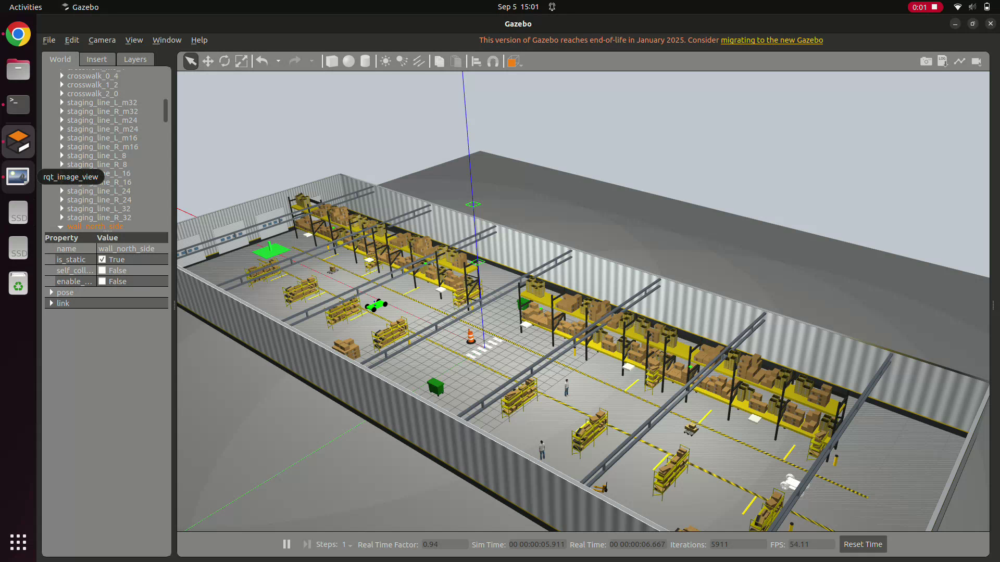
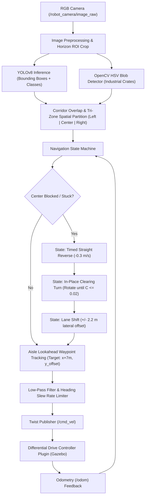

# Autonomous Differential Drive Mobile Robot (AMR) with Vision-Based Perception & Navigation

[](https://docs.ros.org/en/humble/)
[](https://gazebosim.org/)
[](https://github.com/ultralytics/ultralytics)
[](https://python.org)
[](LICENSE)

An advanced ROS 2 (Humble) autonomous mobile robot (AMR) simulation featuring a custom four-wheeled differential drive robot navigating through a photorealistic industrial warehouse environment in Gazebo Classic. The system relies entirely on a forward-facing monocular camera coupled with real-time deep learning (Ultralytics YOLOv8) and classical computer vision to detect obstacles, center within aisles, execute dynamic lane shifts, and recover from dead-ends or blockages using an intelligent recovery state machine.

---

## 🎬 Simulation Demonstration

[](media/simulation_demo.webm)

> **Watch the full video:** Click the thumbnail above or open [`media/simulation_demo.webm`](media/simulation_demo.webm) to watch the robot autonomously navigate through the photorealistic warehouse with real-time YOLOv8 detections, corridor tracking, and obstacle avoidance.

---

## 📖 About The Project

In contemporary logistics and smart warehousing (Industry 4.0), Autonomous Mobile Robots (AMRs) and Automated Guided Vehicles (AGVs) are essential for inventory transport, order fulfillment, and pallet movement. While conventional systems often rely on expensive multi-layer LiDAR scanners or fixed floor magnetic wire grids, this project demonstrates a cost-effective, robust, vision-centric autonomous navigation system.

### Problem Statement & Design Objectives
- **Vision-Only Perception**: Navigate and avoid collisions in a dynamic warehouse using only RGB camera input without relying on LiDAR range finders.
- **Robust Object Detection**: Recognize both standard categories (humans/warehouse workers, carts, chairs, boxes) via YOLOv8 and unlabelled industrial crates via OpenCV color-blob contour analysis.
- **Corridor Centering & Anti-Oscillation**: Prevent typical camera-steering "zigzagging" along repetitive warehouse rack rows through aisle centerline lookahead tracking and steering slew-rate limiting.
- **Proximity Recovery**: When an obstacle completely blocks the corridor or halts forward progress, execute a timed straight reverse followed by an in-place clearing turn before resuming forward travel down an unobstructed lane.

---

## 🧠 System Architecture & Perception Pipeline



### 1. Vision & Detection Pipeline
- **Monocular RGB Camera**: Captures $640 \times 480$ frames at $30\,\text{FPS}$ with a $62.2^\circ$ horizontal FOV.
- **Ultralytics YOLOv8**: Identifies warehouse personnel (`person`), carts, furniture, and parcels in real-time.
- **Adaptive Color-Blob & Contour Detector**: High-contrast HSV color segmentation catches unlabelled cardboard crates, pallets, and hazard drums that may fall outside standard COCO classes.
- **Spatial Tri-Zone Partitioning**: The image horizontal axis is segmented into Left ($[0, w/3]$), Center ($[w/3, 2w/3]$), and Right ($[2w/3, w]$). Obstacles with bounding boxes overlapping the forward driving corridor are projected into occupancy risk scores.

### 2. Decision & Motion Control
- **Centerline Lookahead Steering**: Calculates heading error toward a virtual waypoint placed $7.0\,\text{m}$ ahead along the desired corridor coordinate, eliminating lateral oscillation between rack rows.
- **Dynamic Lane Shifting**: When a side obstacle is detected, the robot smoothly shifts its target corridor ($y_{\text{target}} = y_{\text{aisle}} \pm 2.2\,\text{m}$) into the clear lane.
- **Timed Straight Backup**: If the center occupancy exceeds the critical threshold ($C \ge 0.08$) or position history detects stalled forward motion for $>3.0\,\text{s}$, the robot reverses straight ($v = -0.3\,\text{m/s}, \omega = 0.0\,\text{rad/s}$) for $2.0\,\text{s}$ to prevent tail-swing collisions.
- **In-Place Clearing Turn (`turn_clear`)**: Following backup, forward motion is paused ($v = 0.0\,\text{m/s}$) while the robot rotates in place toward the open direction until its camera confirms the center corridor is unobstructed ($C \le 0.02$).

---

## 🏭 Photorealistic Warehouse Environment

The simulation environment is an $88\,\text{m} \times 30\,\text{m}$ industrial distribution center constructed with high-fidelity PBR assets and procedural textures:
- **Floor Surface**: High-resolution polished concrete with surface micro-texture, specular gloss, and expansion joint seams ([`concrete_floor.png`](warehouse_assets/materials/textures/concrete_floor.png)).
- **Safety Markings**: OSHA-standard $45^\circ$ yellow & black caution hazard stripes along the main transit aisle ([`hazard_stripes.png`](warehouse_assets/materials/textures/hazard_stripes.png)) and pedestrian crosswalks.
- **Storage Racks**: Industrial multi-tier racking populated with merchandise from AWS RoboMaker (`ShelfD_01`, `ShelfE_01`, `ShelfF_01`).
- **Safety Infrastructure**: Safety yellow steel bollards guarding rack corners, wall safety signage, and sectional overhead loading dock doors ([`dock_door.png`](warehouse_assets/materials/textures/dock_door.png)).
- **Dynamic In-Aisle Obstacles**:
  - $x = -24.0\,\text{m}$: Textured Euro-pallet with stacked shipping boxes.
  - $x = -12.0\,\text{m}$: 3D warehouse worker inspecting stock in the aisle.
  - $x = +2.0\,\text{m}$: High-visibility reflective industrial construction barrel dead-center.
  - $x = +16.0\,\text{m}$: Industrial picking utility cart.
  - $x = +28.0\,\text{m}$: Staged cargo pallet with boxes.
  - $x = +40.0\,\text{m}$: High-visibility green AGV delivery station / charging dock.

---

## 🤖 Robot Specifications

| Parameter | Value |
| :--- | :--- |
| **Robot Type** | 4-Wheeled Differential Drive Mobile Robot |
| **Drive Configuration** | Differential Drive (Left & Right wheel pairs driven via Gazebo plugin) |
| **Wheel Separation** | $1.344\,\text{m}$ |
| **Wheel Diameter** | $0.740\,\text{m}$ |
| **Cruising Linear Speed** | $0.70\,\text{m/s}$ |
| **Reverse Speed** | $-0.30\,\text{m/s}$ |
| **Max Angular Velocity** | $0.85\,\text{rad/s}$ |
| **Perception Sensor** | Forward-facing RGB Camera ($640 \times 480$, $30\,\text{Hz}$, $62.2^\circ$ FOV) |
| **Primary Odometry** | Wheel Odometry (`/odom` $\rightarrow$ `base_link` TF) |

---

## 🚀 Quick Start & Usage

### Option A: One-Click Automated Runner (Recommended)
From the repository root, run:
```bash
cd ~/Downloads/Assem_Final_1
./run_simulation.sh
```
> **What this script does automatically:**
> 1. Cleans up any prior Gazebo/ROS processes.
> 2. Configures `GAZEBO_MODEL_PATH` with all local and AWS models.
> 3. Launches Gazebo with `warehouse.world`.
> 4. Spawns the robot at `(-38.0, 0.0, 0.6)`.
> 5. Launches `rqt_image_view` displaying `/yolo_debug/image`.
> 6. Starts `yolo_camera_navigator.py` to navigate to `(40.0, 0.0)`.

---

### Option B: Native ROS 2 Launch File
```bash
source /opt/ros/humble/setup.bash
cd ~/Downloads/Assem_Final_1
ros2 launch launch/warehouse_simulation.launch.py
```

---

### Option C: Step-by-Step Multi-Terminal Execution

#### 1. Clean Up Stale Processes
```bash
pkill -9 -f gzserver; pkill -9 -f gzclient; pkill -9 -f gazebo
pkill -9 -f yolo_camera_navigator.py; pkill -9 -f rqt_image_view
sleep 2
```

#### 2. Terminal 1 — Launch Gazebo Warehouse
```bash
source /opt/ros/humble/setup.bash
export GAZEBO_MODEL_PATH=~/Downloads/Assem_Final_1/warehouse_assets:~/.gazebo/models:~/gazebo_models:~/ros2_ws/install/aws_robomaker_small_warehouse_world/share/aws_robomaker_small_warehouse_world/models:$GAZEBO_MODEL_PATH
ros2 launch gazebo_ros gazebo.launch.py world:=warehouse.world
```

#### 3. Terminal 2 — Spawn Autonomous Robot
```bash
source /opt/ros/humble/setup.bash
cd urdf
ros2 run gazebo_ros spawn_entity.py -entity autonomous_robot -file Assem_Final_1.urdf -x -38 -y 0 -z 0.6
```

#### 4. Terminal 3 — Run YOLO Camera Navigator
```bash
source /opt/ros/humble/setup.bash
python3 yolo_camera_navigator.py --ros-args -p goal_x:=40.0 -p goal_y:=0.0 -p use_sim_time:=true
```

#### 5. Terminal 4 — Live YOLO Detection Camera View
```bash
source /opt/ros/humble/setup.bash
ros2 run rqt_image_view rqt_image_view /yolo_debug/image
```

---

## 📁 Repository Structure

```
├── warehouse.world                  # Complete photorealistic warehouse simulation world
├── make_world.py                    # Procedural generator for warehouse geometry and assets
├── warehouse_assets/                # PBR textures, scripts, and Gazebo model definition
│   ├── materials/
│   │   ├── scripts/warehouse.material
│   │   └── textures/                # High-res concrete, hazard stripes, corrugated wall, dock doors
│   ├── model.config
│   └── model.sdf
├── media/                           # Demonstration media
│   ├── simulation_demo.webm         # Full screen recording of autonomous simulation run
│   └── simulation_demo_thumbnail.png # Preview thumbnail
├── yolo_camera_navigator.py         # Autonomous ROS 2 navigation node with YOLOv8 & blob detection
├── run_simulation.sh                # Automated one-click simulation launcher
├── differential_drive_robot_run_commands.txt # Reference commands list
├── launch/
│   └── warehouse_simulation.launch.py # All-in-one ROS 2 Python launch file
├── urdf/
│   ├── Assem_Final_1.urdf           # Robot URDF model with differential drive plugin & camera sensor
│   └── Assem_Final_1.csv
├── meshes/                          # High-accuracy STL meshes for chassis, wheels, and camera
└── config/                          # YAML joint configurations
```

---

## 🛠️ Requirements & Dependencies

- **Operating System**: Ubuntu 22.04 LTS (Jammy Jellyfish)
- **Robotics Middleware**: ROS 2 Humble Hawksbill (`ros-humble-desktop`, `gazebo-ros-pkgs`)
- **Simulation**: Gazebo Classic 11
- **Python Libraries**:
  - `ultralytics` (YOLOv8)
  - `opencv-python` (`cv2`)
  - `numpy`
  - `torch` / `torchvision`
  - `cv_bridge`

---

## 👤 Author & Maintainer
- **Naveen** — [Naveen-1903 on GitHub](https://github.com/Naveen-1903)
- Repository: [differential-drive-autonomous-robot](https://github.com/Naveen-1903/differential-drive-autonomous-robot)
